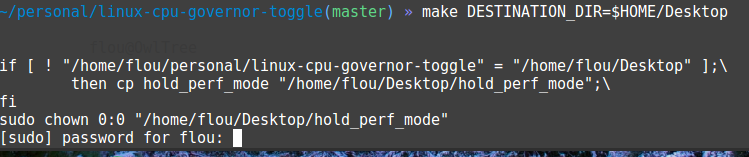
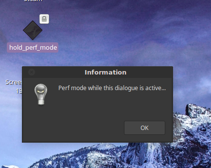

Linux CPU Performance Governor Toggle
============

## TL;DR

In the repo, run `make` with an optional destination



Then, double click the binary (or run in terminal)



## Why

By default, on laptops, cpu governor is in Powersave state.

While this may be desirable to improve battery life, this is typically not changed when plugging the charger.

Performance governor can be an hinderance on CPU heavy tasks: compilation, gaming, 1-have-200-tabs-opened kinds of usage

## How

### Assumptions about CPU governors

The postulate is that, prior to running the binary, active governors for all CPU are `powersave`.

Initial state is not checked.

Additionally, governors are not expected to be modified during the lifetime of the process.

CPU governor states are not checked prior to restoring `powersave`, either.

### Implementation

A setuid binary will set and hold `performance` governor for each CPU until terminated.

Terminated as: normally or otherwise. (signals are handled).

Upon termination, `powersave` governor is restored.

If run outside a terminal, the behaviour will have Zenity be used to display a (program flow-) blocking info popup.

The program will block reading stdin otherwise.

## Usage

### Build

You should have a gcc-compatible compiler callable by `cc` in the path.

You should have `sudo` & _sudoer_ rights for `chown` and `chmod` (setuid bit) commands.

You may override the command called in place of sudo if needed (see the *Makefile*).

You may override installation destination so that the Makefile takes care of copying the binary to a new place before running the _setuid_ target. (a moved setuid target looses its bit)

The `install` target is a no-op if `DESTINATION_DIR` isn't overridden.

Please refer to the Makefile for advanced variables and targets.

### Docker

If you don't want to install a C compiler, you may use the docker targets (see Makefile).

You may override the command called in place of `docker`; e.g. you constrained docker usage to an embastioned user with `sudo -u mydockeruser docker run ...` .

You may override the compiler image. It has to support GNU Make syntax and GCC-compatible syntax through the `cc` command.

Please refer to the Makefile for `make` variables and targets.

### Constrained examples

Implicit _all_ target call build, install, chown, setuid.

For the simple `make` invocation (local build) you should have the `build-essentials` package (debian/ubuntu) or anything similar.

```
$ make DESTINATION_DIR=$HOME/Desktop
# sudo prompts if needed...
# Run it:
$ ~/Desktop/hold_perf_mode
```

Build with Docker? You need docker Community Edition (`docker-ce` package in ubuntu & derivatives).

```
make docker
# installs, chowns and chmods after the build!
```

### Check Governor states for CPUs

It is as easy as:

```
cat /sys/devices/system/cpu/cpu*/cpufreq/scaling_governor
```

How do I known my CPU no longer slacks on Perf mode?

* Fire up some appropriate workload
* Please refer to sys FS entries to check CPU frequency scalling and other metrics. There's plenty to see !
